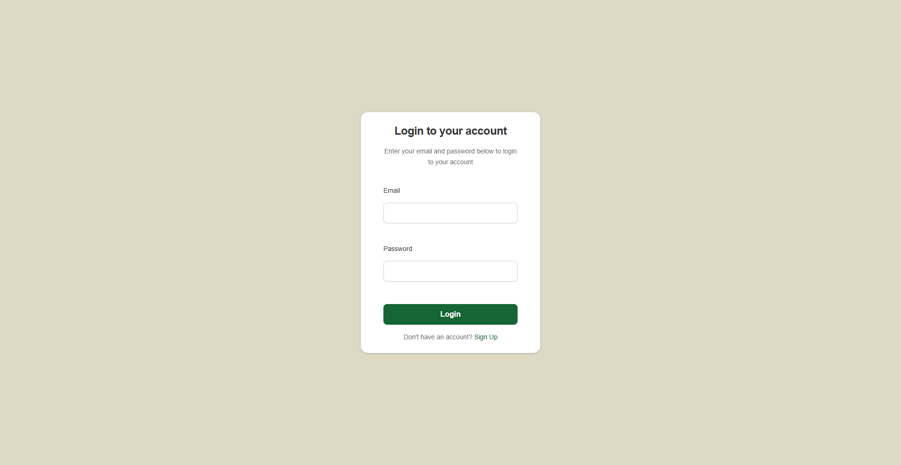
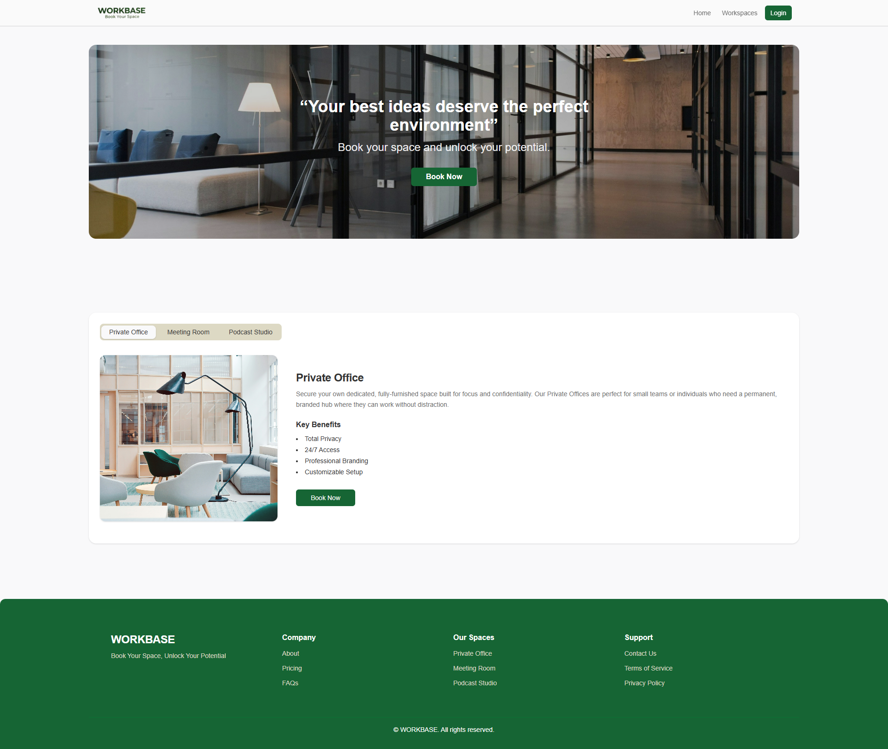
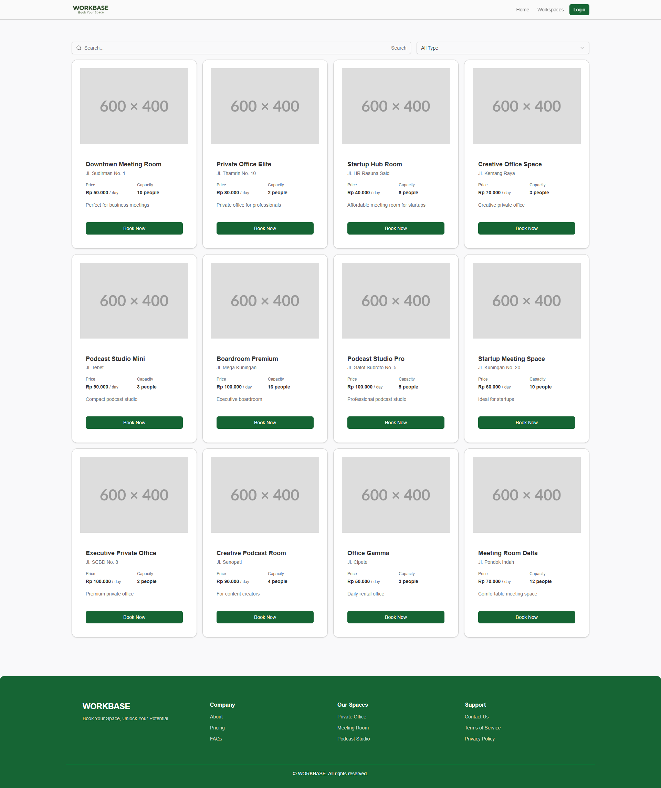
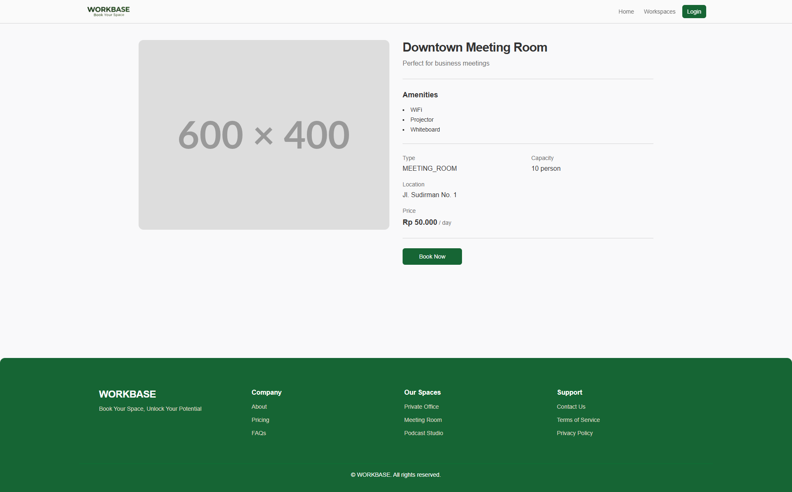
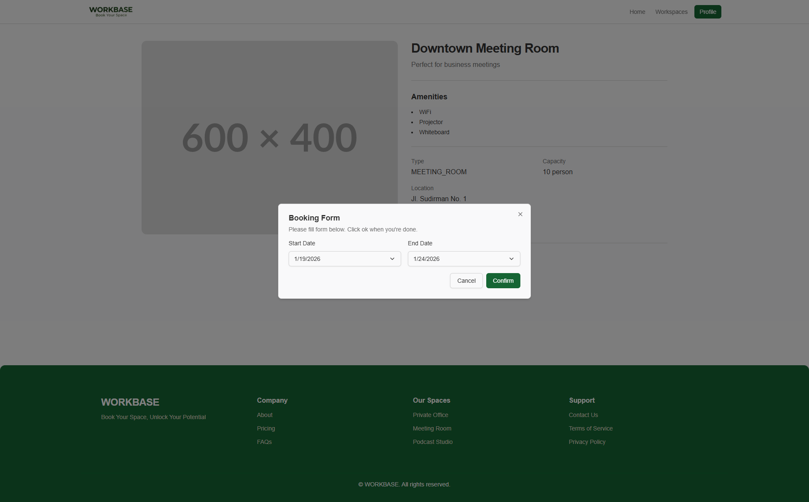
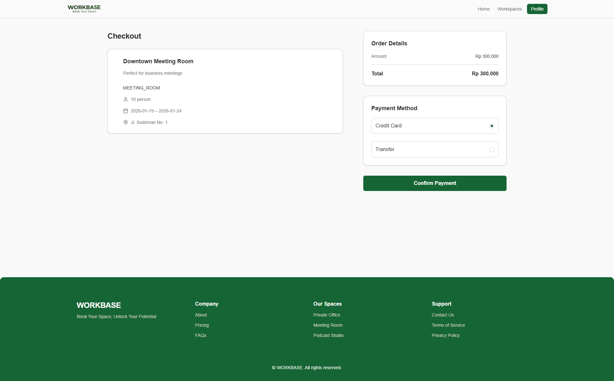
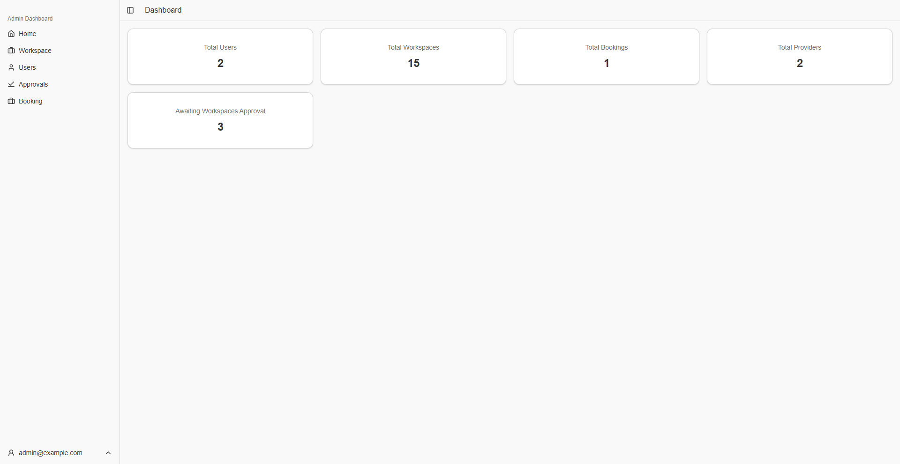

# Coworking Space Booking App

A web application for managing coworking-space bookings, user profiles, and admin/provider dashboards.  
Built with the Next.js App Router, React, Tailwind CSS, and Tanstack Query.

**Coworking Space Booking App Backend**: [Coworking Space Booking App Backend](https://github.com/triyoga884/crack-be-triyoga884)

## Tech Stack

- Next.js 16 (App Router, TypeScript)
- React 19
- Tailwind CSS 4
- @tanstack/react-query for data fetching and caching
- Radix UI and custom UI components
- React Hook Form + Zod for form handling and validation

## Features

- Public landing page with marketing banner and services overview.
- Authentication flow (login, signup, logout) backed by an external API.
- User area to browse workspaces, view workspace details, and make bookings.
- Checkout flow for confirming workspace bookings.
- User profile management.
- Admin/provider dashboard with statistics cards.
- Admin/provider management pages for:
  - Users
  - Workspaces
  - Bookings
  - Approvals

## Project Structure (src)

- `app/`
  - `(auth)/` – authentication layouts and pages (login, signup).
  - `(user)/` – user-facing layouts and pages (home, workspaces, checkout, profile).
  - `(admin)/` – admin/provider dashboard pages and layouts.
  - `providers.tsx` – global React Query provider setup.
  - `layout.tsx` – root layout, metadata, and Nuqs adapter.
- `auth/` – authentication API helpers and React Query hooks.
- `components/` – reusable UI components and feature components (dashboard cards, forms, modals, navigation, etc.).
- `components/ui/` – base UI primitives built on Radix UI and Tailwind.
- `hooks/` – custom hooks (for example, authentication and responsive helpers).
- `lib/` – utilities, shared types, validation schemas, and formatters.
- `assets/` – static data (for example, workspace tab configuration).

## Environment Variables

The frontend communicates with a backend API using a base URL defined in environment variables:

- `NEXT_PUBLIC_LOCAL_API` – base URL of the backend API, e.g. `http://localhost:3001`.

Create an `.env.local` file in the project root:

```bash
NEXT_PUBLIC_LOCAL_API=http://localhost:3001
```

Restart the dev server after changing environment variables.

## Getting Started

### Prerequisites

- Node.js (LTS version recommended)
- npm or another compatible package manager

### Installation

```bash
npm install
```

### Development

Run the development server:

```bash
npm run dev
```

The app will start on `http://localhost:3000` by default.

### Production Build

Create an optimized production build:

```bash
npm run build
```

Start the production server:

```bash
npm start
```

### Linting

Run the linter:

```bash
npm run lint
```

## Available npm Scripts

- `npm run dev` – start the Next.js development server.
- `npm run build` – build the production bundle.
- `npm start` – start the production server.
- `npm run lint` – run ESLint over the codebase.

## Notes

- The backend is currently off, so some pages may show errors when they rely on API responses.
- Some pages are still usable because they display dummy data instead of backend data.
- This project assumes an existing backend that implements the authentication and booking APIs exposed under `NEXT_PUBLIC_LOCAL_API`.
- Authentication uses cookie-based sessions (`credentials: 'include'` on API calls).

## Live Demo

Check out the live demo of the application:

- **URL**: [https://workbase1.netlify.app/](https://workbase1.netlify.app/)
- **Username**: `admin@example.com`
- **Password**: `password123`

## Screenshot Website

#### Login



#### Landing Page



#### Workspaces Page



#### Workspace Detail Page



#### Booking Page



#### Payment Page



#### Dashboard Page



## Demo Video

[Register & Login Flow]([https://github.com/user-attachments/assets/f226d892-fcb2-4a3f-b3e2-01634682c6f3](https://github.com/user-attachments/assets/bc14e7e3-b1fc-4731-b7bb-e28499c77bd4))

https://github.com/user-attachments/assets/bc14e7e3-b1fc-4731-b7bb-e28499c77bd4

[User Booking Flow]([https://github.com/user-attachments/assets/f226d892-fcb2-4a3f-b3e2-01634682c6f3](https://github.com/user-attachments/assets/9dabf94b-394c-4b78-b8cc-bf7c37b74d13))

https://github.com/user-attachments/assets/9dabf94b-394c-4b78-b8cc-bf7c37b74d13

[Provider Create List Workspace FLow]([https://github.com/user-attachments/assets/8d54a9a0-d2e7-48aa-9b35-17a99ea4a36a](https://github.com/user-attachments/assets/8d54a9a0-d2e7-48aa-9b35-17a99ea4a36a))

https://github.com/user-attachments/assets/8d54a9a0-d2e7-48aa-9b35-17a99ea4a36a

[Admin Approve Workspace FLow]([https://github.com/user-attachments/assets/6c4852f7-d64b-408b-b143-2fe79caa9eb1](https://github.com/user-attachments/assets/6c4852f7-d64b-408b-b143-2fe79caa9eb1))

https://github.com/user-attachments/assets/6c4852f7-d64b-408b-b143-2fe79caa9eb1


